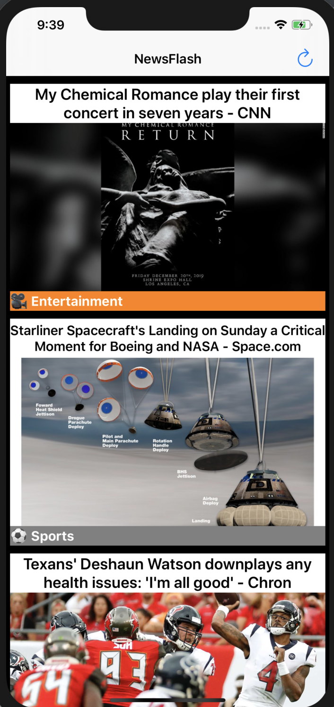

# NewsFlash
 
News app created using Swift with CoreML feature to categorize each story received from NewsAPI. 

Preview Below: 




# Getting Started 

Users can view the latest news received from newsapi and organized based on different categories listed below using CoreML (DocumentClassifier).

Categories:
- Business
- Sports
- Entertainment
- Politics
- Technology 

## Prerequisites 
This is an iOS app and will only work either on iOS simulator or iPhones

# Built With 
- Swift
- CoreML
- DocumentClassifier
    - pod used to determine which category a story is based on 
- StoryBoard
- Alamofire
    - used to make API request 
- Kingfisher
    - used to get image from web link
- NewsAPI

# Code Snippets

Important AlamoFire Code Below due to the new updates 

After added AlamoFire as a Cocopod, the code for making request works well when using switch case method to receive data. After trying a few other methods, I found the following base code for AlamoFire is best to use and while other methods might result in errors and issues, this method been useful to me for this project. 

``` 
AF.request("Include API here").responseJSON { (response) in
    switch response.result {
        case .success(let value):
            console.log(value)
        case .failure(let error):
                print(error)
    }
}
```

# Author
* **Muhammad** - https://github.com/mawais54013